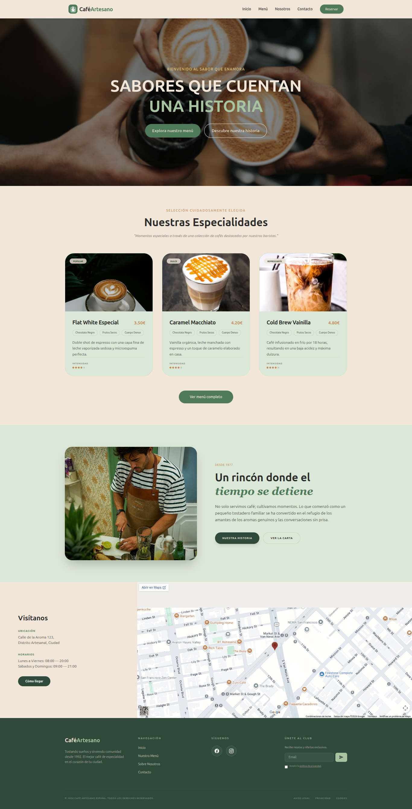
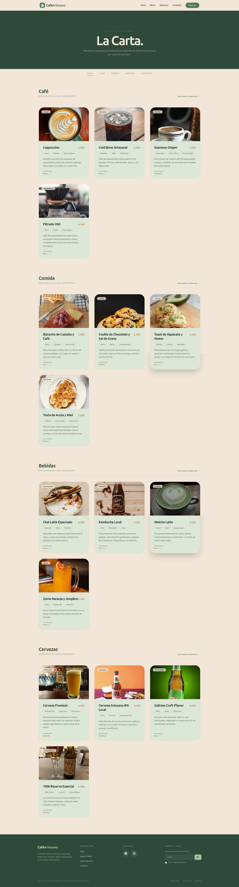

# ☕ Carta Digital para Cafeterías y Bares

Web moderna de menú digital e interactivo para cafeterías, bares y pequeños restaurantes, desarrollada con Astro.

Este proyecto está enfocado en ofrecer una experiencia rápida, visual y responsive donde los clientes puedan consultar la carta desde el móvil mediante códigos QR o enlaces directos.

Diseñado como un proyecto frontend real y parte de mi portfolio público como desarrollador web.

---

## 🚀 Demo Online
[](https://dev-leonardorivera.github.io/digital-menu-astro/)

🔗 URL Demo:  
https://dev-leonardorivera.github.io/digital-menu-astro/

---

## 📸 Vista Previa




---

## ✨ Características

- 📱 Diseño completamente responsive
- ⚡ Alto rendimiento gracias a Astro
- 🍔 Menú digital
- 🎨 Interfaz moderna y limpia
- 🔍 Estructura optimizada para SEO
- 🧾 Categorías de productos
- 🖼️ Imágenes y descripciones
- 📲 Experiencia mobile-first

---

## 🛠️ Tecnologías Utilizadas

- Astro
- HTML5
- CSS3
- Tailwind
- TypeScript
- Responsive Design

---

## 📦 Instalación

Clona el repositorio:

```bash
git clone https://github.com/dev-leonardorivera/digital-menu-astro.git
```

Instala las dependencias:

```bash
npm install
```

---

## ▶️ Desarrollo

Inicia el entorno de desarrollo:

```bash
npx astro dev
```

---

## 🏗️ Build de Producción

Generar build:

```bash
npm run build
```

Previsualizar build:

```bash
npm run preview
```

---

## 🎯 Objetivos del Proyecto

- Crear una aplicación frontend moderna usando Astro
- Construir una solución real para negocios locales
- Mostrar una estructura limpia y profesional

---

## 📱 Diseño Responsive

La interfaz está optimizada para:

- 📱 Móviles
- 💻 Escritorio
- 📲 Tablets

---

## 📄 Licencia

Este proyecto está bajo licencia MIT.

---

## 👨‍💻 Autor

Desarrollado por Leonardo Rivera.

GitHub:  
https://github.com/dev-leonardorivera

---

## ⭐ Apoya el Proyecto

Si te gusta este proyecto puedes darle una estrella en GitHub ⭐

